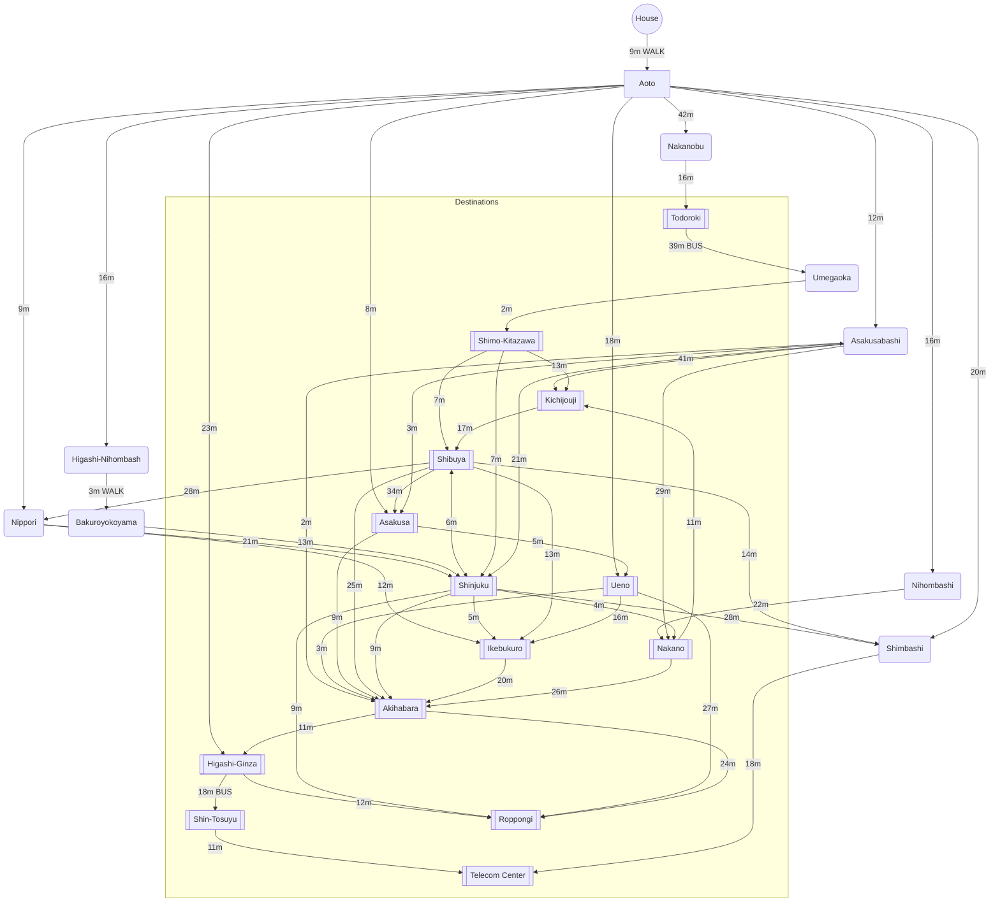

Real travel times between stations in Tokyo, according to Google.
Assuming ~noon as the transit time.
Recommend +5 minutes per station to handle train transfers.

```mermaid
flowchart TD
    House((House))
    Aoto[Aoto]

    Asakusabashi(Asakusabashi)
    Nippori(Nippori)
    Nakanobu(Nakanobu)
    Nihombashi(Nihombashi)
    Shimbashi(Shimbashi)
    HNihombashi(Higashi-Nihombash)
    Bakuroyokoyama(Bakuroyokoyama)
    Umegaoka(Umegaoka)

    subgraph Destinations
    Nakano[[Nakano]]
    Todoroki[[Todoroki]]
    Akihabara[[Akihabara]]
    Ikebukuro[[Ikebukuro]]
    Kichijouji[[Kichijouji]]
    HGinza[[Higashi-Ginza]]
    STosuyu[[Shin-Tosuyu]]
    Telecom[[Telecom Center]]
    Shinjuku[[Shinjuku]]
    Shimokitazawa[[Shimo-Kitazawa]]
    Shibuya[[Shibuya]]
    Ueno[[Ueno]]
    Asakusa[[Asakusa]]
    Roppongi[[Roppongi]]
    end

    House -->|9m WALK| Aoto
    
    Aoto -->|12m| Asakusabashi
    Asakusabashi -->|41m| Kichijouji
    Asakusabashi -->|2m| Akihabara

    Aoto -->|23m| HGinza

    Aoto -->|9m| Nippori
    Nippori -->|12m| Ikebukuro
    Nippori -->|21m| Shinjuku

    Aoto -->|42m| Nakanobu
    Nakanobu -->|16m| Todoroki

    Aoto -->|16m| Nihombashi
    Nihombashi -->|22m| Nakano
    Asakusabashi -->|29m| Nakano

    HGinza -->|18m BUS| STosuyu

    STosuyu -->|11m| Telecom

    Aoto -->|20m| Shimbashi
    Shimbashi -->|18m| Telecom

    Nakano -->|11m| Kichijouji

    Shinjuku-->|4m| Nakano
    Shinjuku -->|5m| Ikebukuro

    Aoto -->|16m| HNihombashi
    HNihombashi -->|3m WALK| Bakuroyokoyama
    Bakuroyokoyama -->|13m| Shinjuku

    Todoroki -->|39m BUS| Umegaoka
    Umegaoka -->|2m| Shimokitazawa
    Shimokitazawa -->|7m| Shibuya

    Aoto -->|18m| Ueno
    Ueno -->|3m| Akihabara

    Aoto -->|8m| Asakusa
    Asakusa -->|5m| Ueno
    Asakusa -->|9m| Akihabara

    Asakusa <-->|3m| Asakusabashi

    HGinza -->|12m| Roppongi

    Shibuya <-->|6m| Shinjuku
    Shimokitazawa -->|7m| Shinjuku
    Shimokitazawa -->|13m| Kichijouji
    Kichijouji -->|17m| Shibuya
    Shibuya -->|13m| Ikebukuro
    Shibuya -->|25m| Akihabara
    Shinjuku -->|9m| Akihabara
    Shinjuku -->|28m| Shimbashi
    Shinjuku -->|9m| Roppongi
    Ueno -->|27m| Roppongi
    Ikebukuro -->|20m| Akihabara
    Asakusabashi -->|21m| Shinjuku
    Nakano -->|26m| Akihabara
    Shibuya -->|14m| Shimbashi
    Shibuya -->|34m| Asakusa
    Akihabara -->|24m| Roppongi
    Akihabara -->|11m| HGinza
    Ueno -->|16m| Ikebukuro
    Shibuya -->|28m| Nippori
```
